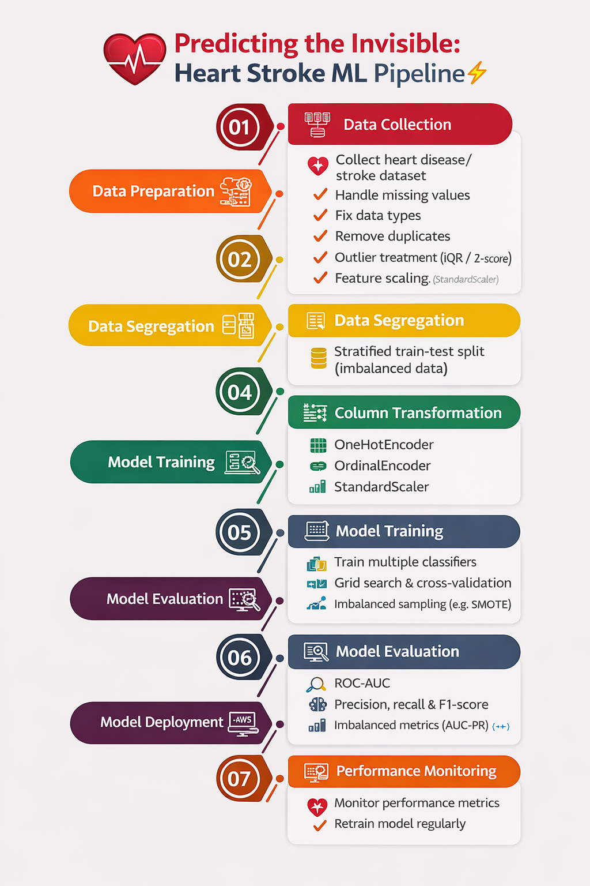

# 🫀 Heart-Stroke-Prediction (ML Pipeline Project)
### 📌 Project Title
# ❤️ Predicting the Invisible: Heart Stroke ML Pipeline 🚑⚡

Welcome to my end-to-end Machine Learning project where clinical data meets structured ML engineering.

In this repository, I built a complete production-style ML pipeline to predict heart-stroke risk using demographic, lifestyle, and medical attributes.

This project focuses not just on modelling, but on building a clean, modular, no-data-leakage pipeline architecture.

Ready to explore the implementation? Check out the Jupyter Notebook
!

<table> <tr> <td width="55%" valign="top">
🧠 The Big Picture: ML Pipeline Architecture

This project follows a structured ML workflow inspired by CRISP-DM methodology:

Problem Understanding: Can we predict heart stroke risk early?

Data Understanding: Explore health, demographic & lifestyle attributes.

Data Preparation: Handle missing values, encode categorical variables, and scale features.

Feature Selection: Identify statistically significant predictors.

Modelling: Train a classification model using a Decision Tree.

Evaluation: Validate model performance and prevent data leakage.

</td> <td width="45%" align="left">
  
 </td> </tr> </table>

🛠️ The ML Engineering Roadmap

1️⃣ Data Cleaning & Preparation 🧼

Raw healthcare datasets contain inconsistencies and missing values.

✔ Median imputation for numerical features 
✔ Mode imputation for categorical features
✔ Standardised target labels (Yes / No → 1 / 0)

2️⃣ Feature Engineering 🔧

Ordinal Encoding

Education level encoded with a logical hierarchy
Uneducated < Primary < Graduate < Postgraduate

One-Hot Encoding

Gender

Previous Stroke History

3️⃣ Feature Scaling ⚖️

MinMax Scaling applied to ensure compatibility with:

Chi-Square statistical feature selection

Distance-based modelling

4️⃣ Feature Selection 📊

Applied:

SelectKBest

Chi-Square statistical test

Goal: Reduce noise and improve model interpretability.

5️⃣ Model Training 🌳

Algorithm Used:

Decision Tree Classifier

Why Decision Tree?

Handles non-linear relationships

Interpretable

Works well with structured healthcare data

📊 Dataset Overview

The dataset includes:

Age

Smoking habits

Blood Pressure (Systolic / Diastolic)

Cholesterol levels

BMI

Glucose

Diabetes & Hypertension indicators

Education level

Previous stroke history

Target Variable:

HeartStroke (Binary Classification)

💡 Key Observations

Smoking and systolic BP show a strong influence.

Glucose variability correlates with higher risk segments.

Hypertension significantly impacts classification splits.

Education & lifestyle factors contribute to secondary signal strength.

🏗️ Production-Ready Architecture

The entire workflow is built inside a single Scikit-Learn Pipeline:

ColumnTransformer

Encoding

Scaling

Feature Selection

Model Training

This ensures:

✔ No data leakage
✔ Clean deployment capability
✔ Reproducibility
✔ Easy model serialisation using Pickle

🚀 Future Improvements

Hyperparameter tuning (GridSearchCV)

Model comparison (Logistic, Random Forest, XGBoost)

ROC-AUC optimization

SHAP for explainability

Streamlit deployment for real-time predictions
